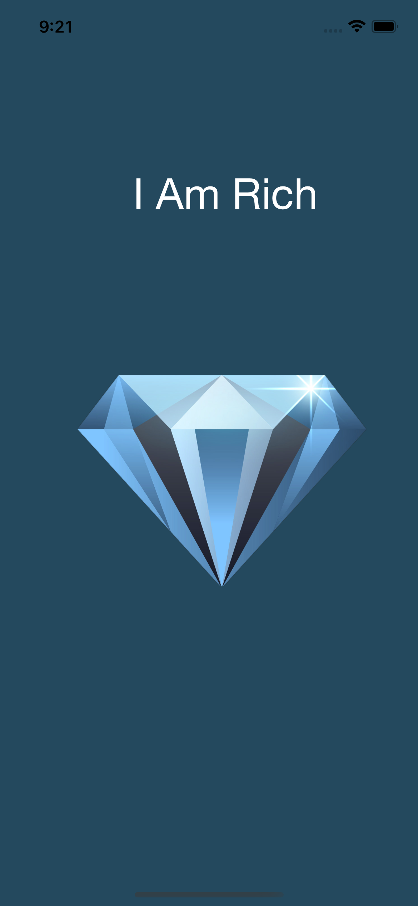
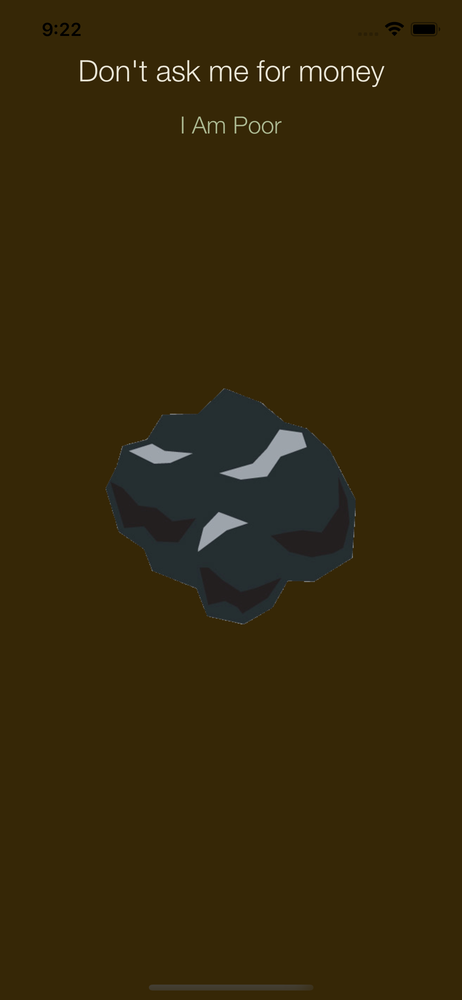
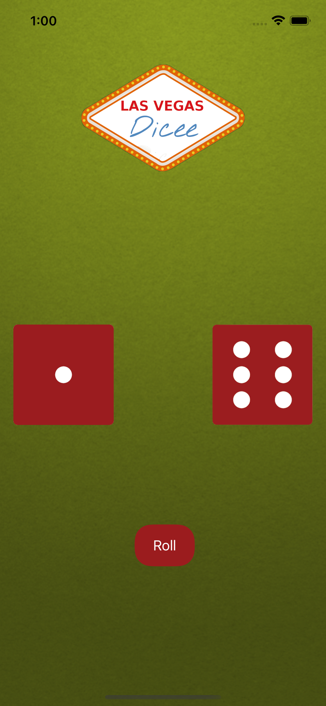
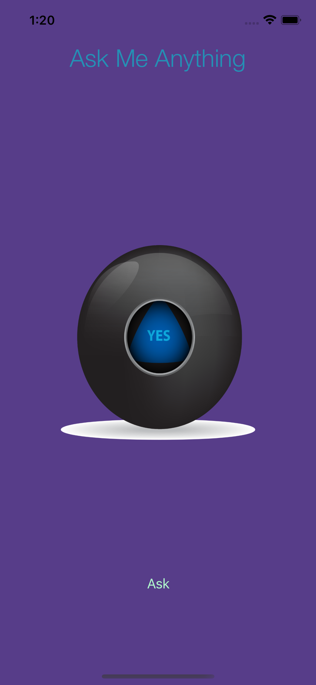
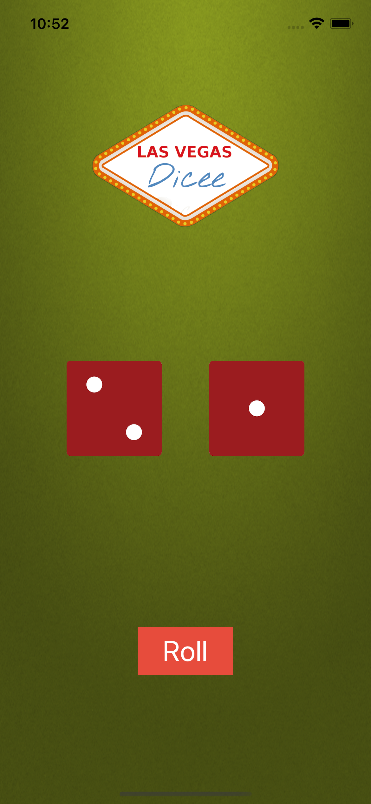
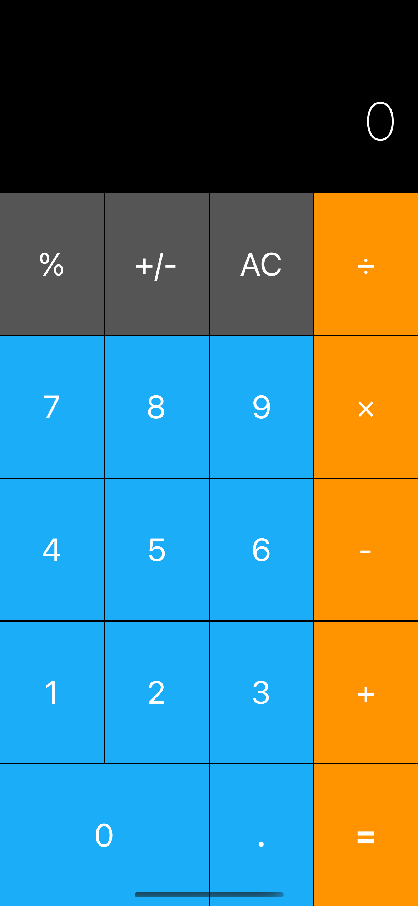
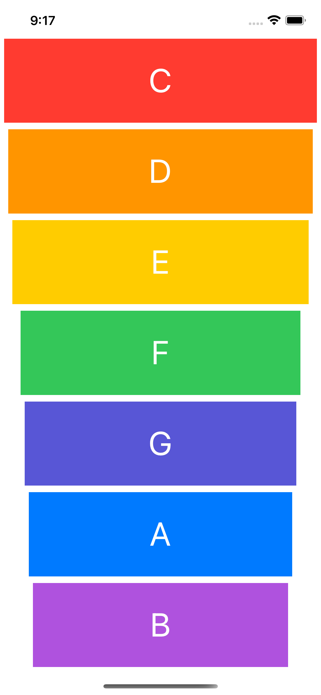
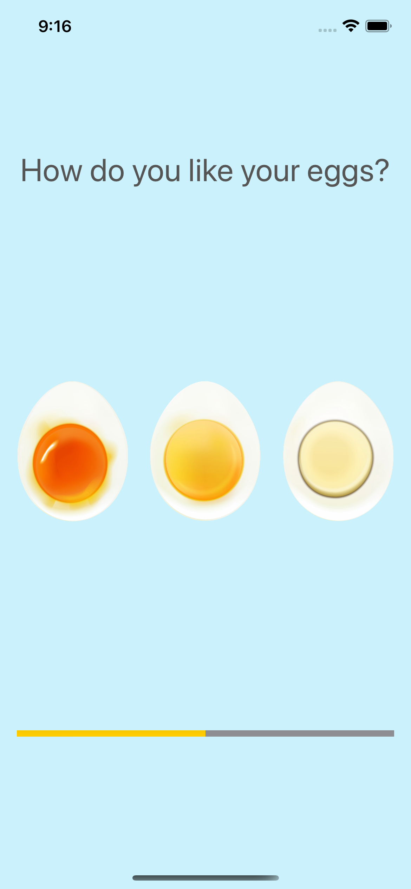
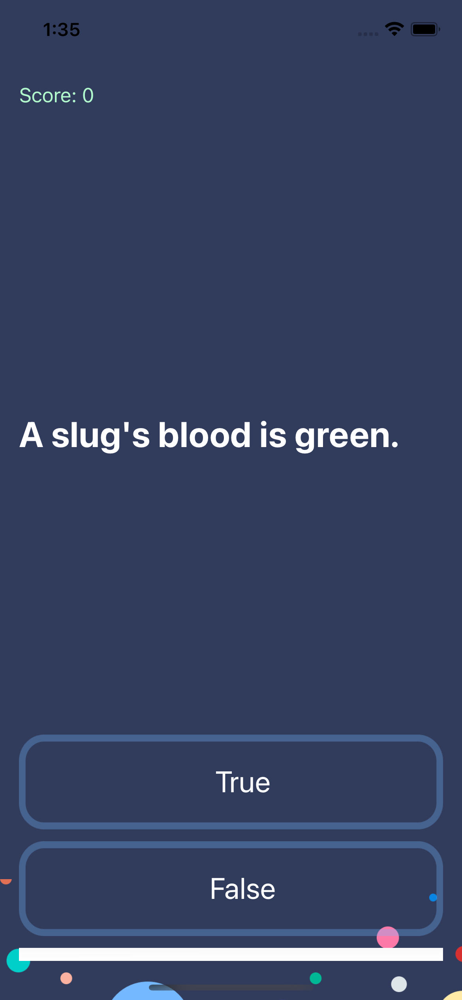
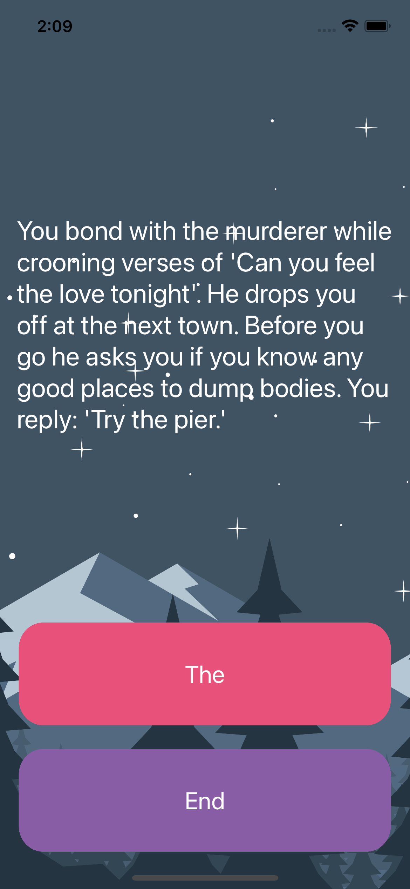

# Swift course - The London App Brewery

## Section 1 - Getting Started with iOS Development and Swift 5 
This course section has a lot on explaining on what and how does an app works, environment setup and so on.

## Section 2 - I am Rich
First Xcode and storybord introduction, Basic usage of Labels and ImageView's.

## [Challenge] Section 3 - I am Poor
First Challenge, same usage of Labels and ImageView's but this time it's all on your own.

## Section 4 - Dicee
First app with user interactions we used *IBActions* and *IBOutlets*.
 

## [Challenge] Section 5 - Magic 8 ball
Second challenge of this course, section prouporse was also to make sure we use *IBActions* and *IBOutlets* in order to make a decision making app.

## Section 6 - AutoLayout and responsive UIs
Going back to **Dicee** app, it's time to add some constraints into it, so user can rotate the device and the app will keep looking good.

 

### [Challenge] Section 6 PT. II - Calculator Layout
AutoLayout challenge on creating a calculator UI, app it's not logic ready.

## Section 7 - Xylophone
**AVFoundation**  use for playing sounds, in this app no UI was managed, all was given by the course.

## Section 8 - Egg Timer
**Timer** use for UI updates and there's also an **AVFoundation** implementation.
 

## Section 9 - Quizzler
**MVC** design patter implementation with some basic UI updates
 

## [Challenge] Section 10 - Destini
**MVC** design patter challenge implementation with some basic UI updates and story flow.
 
